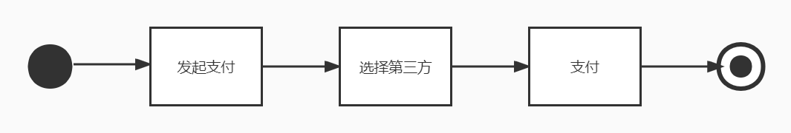
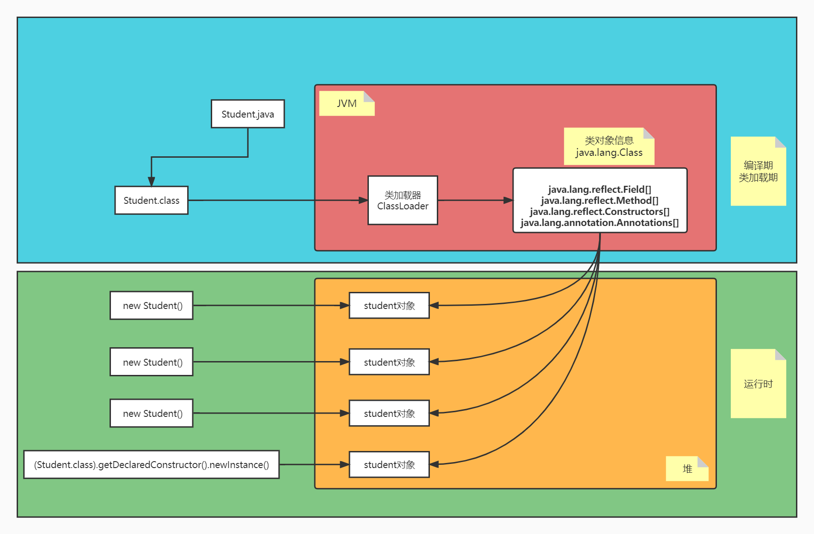

# {{ $frontmatter.title }}

## 1、引入



如图，我们简单地模拟用户点外卖的支付流程，由于第三方支付平台的不确定性，我们的整个支付流程就大有文章可做了。

### 创建类和接口

**创建一个外卖接口**

```java
package com.chaodosen.demo.demo01_introduction;

//接口的指定方：外卖
public interface MeiTuan {
    //在线支付功能
    void payOnline();
}
```

**支付宝支付类**

```java
package com.chaodosen.demo.demo01_introduction;

public class Alipay implements MeiTuan{
    @Override
    public void payOnline() {
        System.out.println("支付宝支付");
    }
}
```

**微信支付类**

```java
package com.chaodosen.demo.demo01_introduction;

public class WeChat implements MeiTuan{
    @Override
    public void payOnline() {
        System.out.println("微信支付");
    }
}
```

**银行卡支付类**

```java
package com.chaodosen.demo.demo01_introduction;

public class BankCard implements MeiTuan{
    @Override
    public void payOnline() {
        System.out.println("银行卡支付");
    }
}
```

### 方式一：传统方式

```java
package com.chaodosen.demo.demo01_introduction;

/**
 * 传统方式实现
 */
public class Test1_tradition {
    public static void main(String[] args) {
        String str = "微信";
        if ("微信".equals(str)){
            pay(new WeChat());
        }
        if ("支付宝".equals(str)){
            pay(new Alipay());
        }
        if ("银行卡".equals(str)){
            pay(new BankCard());
        }
    }
    static void pay(WeChat weChat){
        weChat.payOnline();
    }
    static void pay(Alipay alipay){
        alipay.payOnline();
    }
    static void pay(BankCard bankCard){
        bankCard.payOnline();
    }
}
```

### 方式二：多态

```java
package com.chaodosen.demo.demo01_introduction;

/**
 * 利用多态提高扩展性
 */
public class Test2_polymorphism {
    public static void main(String[] args) {
        String str = "微信";
        if ("微信".equals(str)){
            pay(new WeChat());
        }
        if ("支付宝".equals(str)){
            pay(new Alipay());
        }
        if ("银行卡".equals(str)){
            pay(new BankCard());
        }
    }
    static void pay(MeiTuan meiTuan){
        meiTuan.payOnline();
    }
}
```

### 方式三：反射

```java
package com.chaodosen.demo.demo01_introduction;

import java.lang.reflect.Method;
/**
 * 利用反射实现
 */
public class Test3_reflex {
    public static void main(String[] args) throws Exception {
        String str = "com.chaodosen.demo.demo01_introduction.WeChat";
        Class<?> cls = Class.forName(str);
        Object o = cls.newInstance();
        Method method = cls.getMethod("payOnline");
        method.invoke(o);
    }
}
```

## 2、概念

JAVA反射机制是在**运行状态**中：

- 对于任意一个类，都能够知道这个类的所有属性和方法；
- 对于任意一个对象，都能够调用它的任意方法和属性；
- 这种动态获取信息以及动态调用对象方法的功能称为java语言的反射机制。

在编译后产生字节码文件的时候，类加载器子系统通过二进制字节流，负责从文件系统加载class文件。

在执行程序（java.exe）时候，将字节码文件读入JVM中，这个过程叫做类的加载。

然后在内存中对应创建一个java.lang.Class对象，这个对象会被放入字节码信息中,这个Class对象,就对应加载那个字节码信息,这个对将被作为程序访问方法区中的这个类的各种数据的外部接口。

所以：我们可以通过这个对象看到类的结构，这个对象就好像是一面镜子，透过镜子看到类的各种信息，我们形象的称之为反射这种“看透”class的能力

（theability of the program to examine itself）被称为introspection（内省、内观、反省）。Reflection和introspection是常被并提的两个术语。

**说明：**

- 在运行期间，如果我们要产生某个类的对象，Java虚拟机(JVM)会检查该类型的Class对象是否已被加载。
- 如果没有被加载，JVM会根据类的名称找到.class文件并加载它。
- 一旦某个类型的Class对象已被加载到内存，就可以用它来产生该类型的所有对象。

**补充:**

动态语言 vs 静态语言

1、动态语言

是一类在运行时可以改变其结构的语言:例如新的函数、对象、甚至代码可以被引进，已有的函数可以被删除或是其他结构上的变化。通俗点说就是在运行时代码

可以根据某些条件改变自身结构。主要动态语言: Object-C、 C#、JavaScript、 PHP、 Python、 Erlang 。

2、静态语言

与动态语言相对应的，运行时结构不可变的语言就是静态语言。如Java、C、C++。所以Java不是动态语言，但Java可以称之为“准动态语言”。即Java有一定的动态

性，我们可以利用反射机制、字节码操作获得类似动态语言的特性。Java的动态性让编程的时候更加灵活! 

## 3、类加载与反射




如图为Student类的加载过程：

- Student.java经过编译，得到Student.class字节码文件
- 经过类加载器在方法区中实例化一个Class对象
- 一个Class类（字节码文件）对应一个Class对象
- 该Class对象包含了Student类的基础信息：
  - 属性 
  - 构造方法
  - 方法
  - 注解
  - .....

有了这些基本信息(java.lang.Class对象)，在**运行期**就可以根据这些信息来实例化Student类的对象

- new Student()
- (Student.class).getDeclaredConstructor().newInstance()

**但是无论new 多少个Student对象，无论反射构建多少个Student对象，保存Student类信息的java.lang.Class对象都只有一个。**

下面代码可以证明：

```java
Class<?> cls1 = Class.forName("com.chaodosen.demo.demo02_preparation.Student");
Class<?> cls2 = Class.forName("com.chaodosen.demo.demo02_preparation.Student");
Class<? extends Student> cls3 = new Student().getClass();
Class<? extends Student> cls4 = new Student().getClass();
System.out.println(cls1==cls2);
System.out.println(cls2==cls3);
System.out.println(cls3==cls4);
```

`以上结果均为true`

## 4、操作反射的Java类

`Person类`

```Java
package com.chaodosen.demo.demo02_preparation;

import java.io.Serializable;

//作为一个父类
public class Person implements Serializable {
    //属性
    private int age;
    public String name;

    //方法
    private void eat(){
        System.out.println("Person.eat");
    }
    public void sleep(){
        System.out.println("Person.sleep");
    }
}
```

`Student类`

```java
package com.chaodosen.demo.demo02_preparation;

//Student作为子类
@MyAnnotation(value = "hello Student")
public class Student extends Person implements MyInterface{
    //属性
    private int sno;
    double height;
    protected double weight;
    public double score;

    //方法
    @MyAnnotation(value = "hello showInfo")
    public String showInfo(){
        return "I'm a good student";
    }
    public String showInfo(int a,int b){
        return "overload -> I'm a good student";
    }
    private void work(int a){
        System.out.println("I want to be a coder");
    }
    void happy(){
        System.out.println("wish u happy everyday");
    }
    protected int getSno(){
        return sno;
    }
    public static void test(){
        System.out.println("test");
    }

    //构造器
    public Student(){
        System.out.println("NoConstructor");
    }
    public Student(double weight,double height){
        this.weight = weight;
        this.height = height;
    }
    private Student(int sno){
        this.sno = sno;
    }
    Student(int sno,double weight){
        this.sno = sno;
        this.weight = weight;
    }
    protected Student(int sno,double weight,double height){
        this.sno = sno;
        this.weight = weight;
        this.height = height;
    }

    @Override
    @MyAnnotation(value = "hello myMethod")
    public void myMethod() throws RuntimeException{
        System.out.println("override myMethod()");
    }

    @Override
    public String toString() {
        return "Student{" +
                "sno=" + sno +
                ", height=" + height +
                ", weight=" + weight +
                ", score=" + score +
                '}';
    }
}
```

`自定义接口MyInterface`

```java
package com.chaodosen.demo.demo02_preparation;

public interface MyInterface {
    void myMethod();
}
```

`自定义注解MyAnnotation`

```java
package com.chaodosen.demo.demo02_preparation;

import java.lang.annotation.Retention;
import java.lang.annotation.RetentionPolicy;
import java.lang.annotation.Target;

import static java.lang.annotation.ElementType.*;
import static java.lang.annotation.ElementType.LOCAL_VARIABLE;

/*
    @Target: 定义当前注解能够修饰程序中的哪些元素
    @Retention: 定义注解的生命周期
 */
@Target({TYPE, FIELD, METHOD, PARAMETER, CONSTRUCTOR, LOCAL_VARIABLE})
@Retention(RetentionPolicy.RUNTIME)
public @interface MyAnnotation {
    String value();
}
```

### 4.1、获取字节码的四种方式

```java
package com.chaodosen.demo.demo03_get_bytecode_info;

import com.chaodosen.demo.demo02_preparation.Person;

public class Test {
    public static void main(String[] args) throws Exception{
        //以Person的字节码信息为例
        // 1、通过getClass()获取
        Person person = new Person();
        Class<? extends Person> class1 = person.getClass();
        System.out.println(class1);

        // 2、通过内置class属性
        Class<Person> class2 = Person.class;
        System.out.println(class2);
        System.out.println(class1==class2);

        // 3、调用Class类提供的静态方法forName
        Class<?> class3 = Class.forName("com.chaodosen.demo.demo02_preparation.Person");
        System.out.println(class3);

        // 4、通过当前类拿到类加载器，用类加载器获取对应的字节码对象
        ClassLoader classLoader = Test.class.getClassLoader();
        Class<?> class4 = classLoader.loadClass("com.chaodosen.demo.demo02_preparation.Person");
        System.out.println(class4);
    }
}
```

> 其中第三种是最常用的获取Class对象的方法，因为字符串传参增强了配置的灵活性

### 4.2、可以作为Class对象的种类

```java
package com.chaodosen.demo.demo04_instances_of_class;

import com.chaodosen.demo.demo02_preparation.Person;

/*
    Class类的具体的实例：
        1、类：内部类、外部类
        2、接口
        3、注解
        4、数组
        5、基本数据类型
        6、void
 */
public class Test {
    public static void main(String[] args) {
        Class<Person> class1 = Person.class;
        Class<Comparable> class2 = Comparable.class;
        Class<Override> class3 = Override.class;

        int[] arr1 = {1,2,3};
        Class<? extends int[]> class4 = arr1.getClass();
        int[] arr2 = {5,6,7};
        Class<? extends int[]> class5 = arr2.getClass();
        System.out.println(class4==class5);//相同维度和数据类型得到的字节码是同一个

        Class<Integer> class6 = int.class;
        System.out.println(class6);

        Class<Void> class7 = void.class;
        System.out.println(class7);

    }
}
```

### 4.3、获取构造器并创建对象

```java
package com.chaodosen.demo.demo05_operator;

import com.chaodosen.demo.demo02_preparation.Student;

import java.lang.reflect.Constructor;

public class GetConstructor {
    public static void main(String[] args) throws Exception {
        //获取字节码信息
        Class<Student> class1 = Student.class;

        //通过字节码信息可以获取的构造器
        //getConstructors()只能获取当前运行时类中被public修饰的构造器
        Constructor<?>[] c1 = class1.getConstructors();
        for (Constructor<?> c : c1) {
            System.out.println(c);
        }
        System.out.println("--------------------------------------------------------------");
        //getDeclaredConstructors() 可以获取运行时类的全部构造器
        Constructor<?>[] c2 = class1.getDeclaredConstructors();
        for (Constructor<?> c : c2) {
            System.out.println(c);
        }
        Student student = class1.getDeclaredConstructor().newInstance();
        System.out.println("--------------------------------------------------------------------------");
        //获取指定的构造器
        //获取空的构造器
        Constructor<Student> c3 = class1.getConstructor();
        System.out.println(c3);

        //得到两个参数的有参构造器
        Constructor<Student> c4 = class1.getConstructor(double.class, double.class);
        System.out.println(c4);

        //得到一个参数的构造器且是private修饰的
        Constructor<Student> c5 = class1.getDeclaredConstructor(int.class);
        System.out.println(c5);

        //有了构造器之后就可以创建对象
        Student student1 = c3.newInstance();
        System.out.println(student1);

        Student student2 = c4.newInstance(180.5, 120.6);
        System.out.println(student2);
    }
}
```

### 4.4、获取属性并赋值

```java
package com.chaodosen.demo.demo05_operator;

import com.chaodosen.demo.demo02_preparation.Student;

import java.lang.reflect.Field;
import java.lang.reflect.Modifier;

public class GetField {
    public static void main(String[] args) throws NoSuchFieldException, InstantiationException, IllegalAccessException {
        //获取字节码信息
        Class<Student> cls = Student.class;

        //获取属性
        //getFields()获取当前运行时类和父类中被public修饰的方法
        Field[] f1 = cls.getFields();
        for (Field field : f1) {
            System.out.println(field);
        }
        System.out.println("------------------------------------------------------------");

        //getDeclaredFields()获取运行时类中的所有属性
        Field[] f2 = cls.getDeclaredFields();
        for (Field field : f2) {
            System.out.println(field);
        }
        System.out.println("---------------------------------------------------------------");

        //获取指定的属性
        Field name = cls.getField("name");
        System.out.println(name);

        Field sno = cls.getDeclaredField("sno");
        System.out.println(sno);

        System.out.println("--------------------------------------------------------------------");
        //获取属性的具体结构
        //修饰符
        int modifiers = sno.getModifiers();
        System.out.println(modifiers);
        System.out.println(Modifier.toString(modifiers));
        //数据类型
        Class<?> type = sno.getType();
        System.out.println(type);
        //属性名
        String s = sno.getName();
        System.out.println(s);

        System.out.println("-------------------------------------------------------------------------");

        //给属性赋值 :前提必须要有对象
        Field score = cls.getField("score");
        Student student = cls.newInstance();
        score.set(student,98.0);
        System.out.println(student);
    }
}
```

### 4.5、获取方法并调用

```java
package com.chaodosen.demo.demo05_operator;

import com.chaodosen.demo.demo02_preparation.Student;

import java.lang.annotation.Annotation;
import java.lang.reflect.InvocationTargetException;
import java.lang.reflect.Method;
import java.lang.reflect.Modifier;

public class GetMethod {
    public static void main(String[] args) throws NoSuchMethodException, InstantiationException, IllegalAccessException, InvocationTargetException {
        //获取字节码信息
        Class<Student> cls = Student.class;

        //获取方法
        //getMethods() 获取运行时类和所有父类中被public修饰的方法
        Method[] m1 = cls.getMethods();
        for (Method method : m1) {
            System.out.println(method);
        }

        System.out.println("-----------------------------------------------------------");
        //getDeclaredMethods()获取运行时类中的所有方法
        Method[] m2 = cls.getDeclaredMethods();
        for (Method method : m2) {
            System.out.println(method);
        }

        System.out.println("----------------------------------------------------------------------------");
        //获取指定的方法
        Method m3 = cls.getMethod("showInfo");
        System.out.println(m3);
        Method m4 = cls.getMethod("showInfo", int.class,int.class);
        System.out.println(m4);

        System.out.println("*---------------------------------------------------------------------");
        Method work = cls.getDeclaredMethod("work",int.class);
        System.out.println(work);

        //获取方法的具体结构
        //修饰符
        int modifiers = work.getModifiers();
        System.out.println(Modifier.toString(modifiers));
        //返回值
        Class<?> type = work.getReturnType();
        System.out.println(type);
        //方法名
        String name = work.getName();
        System.out.println(name);
        //参数列表
        Class<?>[] parameterTypes = work.getParameterTypes();
        for (Class<?> parameterType : parameterTypes) {
            System.out.println(parameterType);
        }
        System.out.println("-----------------------------------------------------------------");

        //获取注解
        Method myMethod = cls.getMethod("myMethod");
        Annotation[] annotations = myMethod.getAnnotations();
        for (Annotation annotation : annotations) {
            System.out.println(annotation);
        }
        System.out.println("------------------------------------------------------");
        //获取异常
        Class<?>[] exceptionTypes = myMethod.getExceptionTypes();
        for (Class<?> exceptionType : exceptionTypes) {
            System.out.println(exceptionType);
        }

        System.out.println("---------------------------------------------------------------");
        //调用方法
        Student student = cls.newInstance();
        myMethod.invoke(student);

        Object o = m4.invoke(student, 1, 2);
        System.out.println(o);
    }
}
```

### 4.6、获取类的接口、所在包、注解

```java
package com.chaodosen.demo.demo05_operator;

import com.chaodosen.demo.demo02_preparation.Student;

import java.lang.annotation.Annotation;

public class GetClassInfo {
    public static void main(String[] args) {
        //获取字节码信息
        Class<Student> cls = Student.class;

        //获取接口
        Class<?>[] interfaces = cls.getInterfaces();
        for (Class<?> anInterface : interfaces) {
            System.out.println(anInterface);
        }
        Class<? super Student> superclass = cls.getSuperclass();
        Class<?>[] interfaces1 = superclass.getInterfaces();
        for (Class<?> aClass : interfaces1) {
            System.out.println(aClass);
        }
        //获取运行时类所在的包
        Package aPackage = cls.getPackage();
        System.out.println(aPackage);
        System.out.println(aPackage.getName());

        Annotation[] annotations = cls.getAnnotations();
        for (Annotation annotation : annotations) {
            System.out.println(annotation );
        }
    }
}
```

## 5、应用场景

### 5.1、通过配置信息调用类的方法

```java
package com.chaodosen.demo.demo06_extend;

import java.lang.reflect.InvocationTargetException;
import java.lang.reflect.Method;

public class Extend {
    public void invokeClassMethod(String className,
                                  String methodName,
                                  Object ... args)
            throws ClassNotFoundException,
            InstantiationException,
            IllegalAccessException,
            NoSuchMethodException,
            InvocationTargetException {
        //获取字节码信息
        Class<?> cls = Class.forName(className);
        //创建对象（对象实例化）
        Object o = cls.newInstance();
        //获取并调用方法
        Method method = cls.getMethod(methodName);
        method.invoke(o,args);
    }
}
```

### 5.2、结合注解特殊使用

```java
package com.chaodosen.demo.demo06_extend;

import java.lang.annotation.ElementType;
import java.lang.annotation.Retention;
import java.lang.annotation.RetentionPolicy;
import java.lang.annotation.Target;

@Target(ElementType.TYPE)
@Retention(RetentionPolicy.RUNTIME)
public @interface TableName {
    String name();
}
```

```java
package com.chaodosen.demo.demo06_extend;

@TableName(name = "student")
public class Student {
    public String name;
    private int age;
}
```


```xml
<dependency>
    <groupId>org.reflections</groupId>
    <artifactId>reflections</artifactId>
    <version>0.10.2</version>
</dependency>
```

```java
package com.chaodosen.demo.demo06_extend;

import org.reflections.Reflections;

import java.util.Set;

public class Test {
    public static void main(String[] args) {
        String packageName = "com.chaodosen.demo.demo06_extend";
        Reflections reflections = new Reflections(packageName);
        Set<Class<?>> set = reflections.getTypesAnnotatedWith(TableName.class);
        for (Class<?> cls : set) {
            TableName tableName = cls.getAnnotation(TableName.class);
            System.out.println(tableName.name());
        }
    }
}
```

> 待做：构建MybatisPlus

## 6、优缺点

- 优点：
  - 自由，使用灵活，不受类的访问权限限制。
  - 可以根根据类名、方法名来调用方法、使很多业务实现可以灵活配置
- 缺点
  - 正由于反射不受类的访问权限的限制，导致了安全性低
  - 相对于正常的创建对象调用访问，反射由于存在类和方法的实例化过程，性能相对也较低
  - 破坏了java类的封装性、类的信息隐藏性和边界被破坏