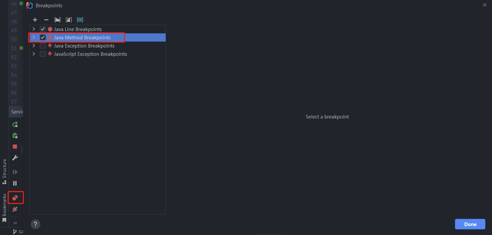
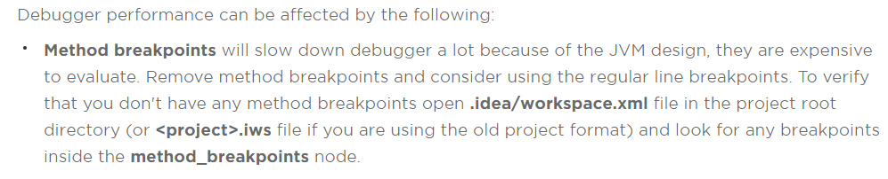

# {{ $frontmatter.title }}

::: danger

**真相只有一个！**

:::

## 报错信息

**Method breakpoints may dramatically slow down debugging**

## 解决办法

打开 `Breakpoints` 找到对应的  `Method Breakpoints`  关闭就好了，应该是不小心点到的

## 原因所在

*由于 JVM的设计，方法断点会大大降低调试器的运行速度，它们的评估成本很高*

[官方文档](https://intellij-support.jetbrains.com/hc/en-us/articles/206544799-Java-slow-performance-or-hangups-when-starting-debugger-and-stepping)

