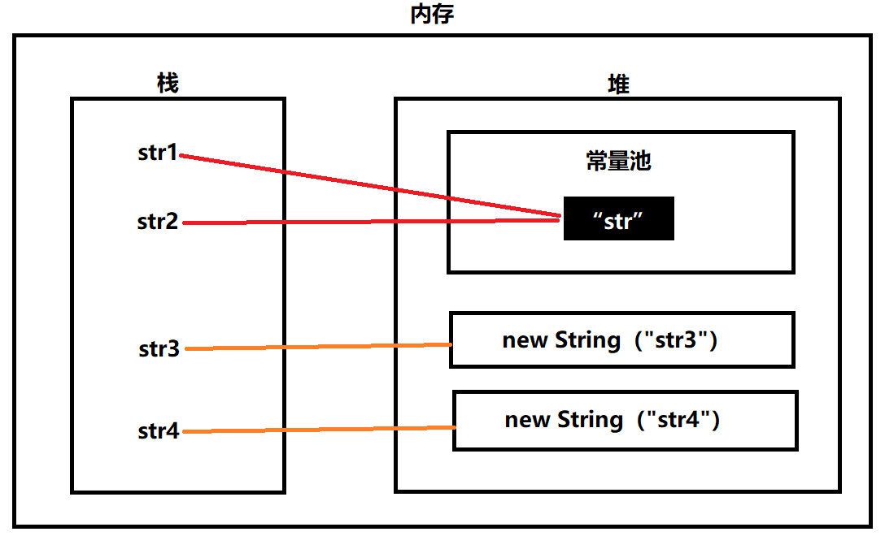

## 1.Java语言具有哪些特点？

1. Java为纯面向对象的语言。它能够直接反应现实生活中的对象。
2. 具有平台无关性。java利用Java虚拟机运行字节码，无论是在Windows、Linux还是MacOS等其它平台对Java程序进行编译，编译后的程序可在其它平台运行。
3. Java为解释型语言，编译器把Java代码编译成平台无关的中间代码，然后在JVM上解释运行，具有很好的可移植性。
4. Java提供了很多内置类库。如对多线程支持，对网络通信支持，最重要的一点是提供了垃圾回收器。
5. Java具有较好的安全性和健壮性。Java提供了异常处理和垃圾回收机制，去除了C++中难以理解的指针特性。
6. Java语言提供了对Web应用开发的支持。

## 2.面向对象的三大特性？

1. 继承：对象的一个新类可以从现有的类中派生，派生类可以从它的基类那继承方法和实例变量，且派生类可以修改或新增新的方法使之更适合特殊的需求。
2. 封装：将客观事物抽象成类，每个类可以把自身数据和方法只让可信的类或对象操作，对不可信的进行信息隐藏。
3. 多态：允许不同类的对象对同一消息作出响应。不同对象调用相同方法即使参数也相同，最终表现行为是不一样的。

## 3.字节序定义以及Java属于哪种字节序？

字节序是指多字节数据在计算机内存中存储或网络传输时个字节的存储顺序。通常由小端和大端两组方式。

1. 小端:低位字节存放在内存的低地址端，高位字节存放在内存的高地址端。
2. 大端：高位字节存放在内存的低地址端，低位字节存放在内存的高地址端。

Java语言的字节序是大端。

## 4.JDK与JRE有什么区别？

1. JDK：Java开发工具包（Java Development Kit），提供了Java的开发环境和运行环境。
2. JRE：Java运行环境(Java Runtime Environment)，提供了Java运行所需的环境。

JDK包含了JRE。如果只运行Java程序，安装JRE即可。要编写Java程序需安装JDK.

## 5.简述Java访问修饰符

- default: 默认访问修饰符，在同一包内可见
- private: 在同一类内可见，不能修饰类
- protected : 对同一包内的类和所有子类可见，不能修饰类
- public: 对所有类可见

## 6.构造方法、成员变量初始化以及静态成员变量三者的初始化顺序？

先后顺序：静态成员变量、成员变量、构造方法。 

详细的先后顺序：父类静态变量、父类静态代码块、子类静态变量、子类静态代码块、父类非静态变量、父类非静态代码块、父类构造函数、子类非静态变量、子类非静态代码块、子类构造函数。

## 7.接口和抽象类的相同点和区别？

相同点:

1. 都不能被实例化。
2. 接口的实现类或抽象类的子类需实现接口或抽象类中相应的方法才能被实例化。

不同点：

1. 接口只能有方法定义，不能有方法的实现，而抽象类可以有方法的定义与实现。
2. 实现接口的关键字为implements,继承抽象类的关键字为extends。一个类可以实现多个接口，只能继承一个抽象类。
3. 当子类和父类之间存在逻辑上的层次结构，推荐使用抽象类，有利于功能的累积。当功能不需要，希望支持差别较大的两个或更多对象间的特定交互行为，推荐使用接口。使用接口能降低软件系统的耦合度，便于日后维护或添加删除方法。

## 8.为什么Java语言不支持多重继承？

1. 为了程序的结构能够更加清晰从而便于维护。假设Java语言支持多重继承，类C继承自类A和类B,如果类A和B都有自定义的成员方法f(),那么当代码中调用类C的f()会产生二义性。Java语言通过实现多个接口间接支持多重继承，接口由于只包含方法定义，不能有方法的实现，类C继承接口A与接口B时即使它们都有方法f(),也不能直接调用方法，需实现具体的f()方法才能调用，不会产生二义性。
2. 多重继承会使类型转换、构造方法的调用顺序变得复杂，会影响到性能。

## 9.Java提供的多态机制？

Java提供了两种用于多态的机制，分别是重载与覆盖。

1. 重载：重载是指同一个类中有多个同名的方法，但这些方法有不同的参数，在编译期间就可以确定调用哪个方法。
2. 覆盖：覆盖是指派生类重写基类的方法，使用基类指向其子类的实例对象，或接口的引用变量指向其实现类的实例对象，在程序调用的运行期根据引用变量所指的具体实例对象调用正在运行的那个对象的方法，即需要到运行期才能确定调用哪个方法。

## 10.重载与覆盖的区别？

1. 覆盖是父类与子类之间的关系，是垂直关系；重载是同一类中方法之间的关系，是水平关系。
2. 覆盖只能由一个方法或一对方法产生关系；重载是多个方法之间的关系。
3. 覆盖要求参数列表相同；重载要求参数列表不同。
4. 覆盖中，调用方法体是根据对象的类型来决定的，而重载是根据调用时实参表与形参表来对应选择方法体。
5. 重载方法可以改变返回值的类型，覆盖方法不能改变返回值的类型

## 11.final、finally和finalize的区别是什么？

1. final用于声明属性、方法和类，分别表示属性不可变、方法不可覆盖、类不可继承。
2. finally作为异常处理的一部分，只能在try/catch语句中使用，finally附带一个语句块用来表示这个语句最终一定被执行，经常被用在需要释放资源的情况下。
3. finalize是Object类的一个方法，在垃圾收集器执行的时候会调用被回收对象的finalize()方法。当垃圾回收器准备好释放对象占用空间时，首先会调用finalize()方法，并在下一次垃圾回收动作发生时真正回收对象占用的内存。

## 12.出现在Java程序中的finally代码块是否一定会执行？

当遇到下面情况不会执行。

1. 当程序在进入try语句块之前就出现异常时会直接结束。
2. 当程序在try块中强制退出时，如使用System.exit(0)，也不会执行finally块中的代码。

其它情况下，在try/catch/finally语句执行的时候，try块先执行，当有异常发生，catch和finally进行处理后程序就结束了，当没有异常发生，在执行完finally中的代码后，后面代码会继续执行。值得注意的是，当try/catch语句块中有return时，finally语句块中的代码会在return之前执行。如果try/catch/finally块中都有return语句，finally块中的return语句会覆盖try/catch模块中的return语句。

## 13.Java语言中关键字static的作用是什么？

static的主要作用有两个：

1. 为某种特定数据类型或对象分配与创建对象个数无关的单一的存储空间。
2. 使得某个方法或属性与类而不是对象关联在一起，即在不创建对象的情况下可通过类直接调用方法或使用类的属性。

具体而言static又可分为4种使用方式：

1. 修饰成员变量。用static关键字修饰的静态变量在内存中只有一个副本。只要静态变量所在的类被加载，这个静态变量就会被分配空间，可以使用''类.静态变量''和''对象.静态变量''的方法使用。
2. 修饰成员方法。static修饰的方法无需创建对象就可以被调用。static方法中不能使用this和super关键字，不能调用非static方法，只能访问所属类的静态成员变量和静态成员方法。
3. 修饰代码块。JVM在加载类的时候会执行static代码块。static代码块常用于初始化静态变量。static代码块只会被执行一次。
4. 修饰内部类。static内部类可以不依赖外部类实例对象而被实例化。静态内部类不能与外部类有相同的名字，不能访问普通成员变量，只能访问外部类中的静态成员和静态成员方法。

## 14.Java代码块执行顺序

1. 父类静态代码块（只执行一次）
2. 子类静态代码块（只执行一次）
3. 父类构造代码块
4. 父类构造函数
5. 子类构造代码块
6. 子类构造函数
7. 普通代码块

## 15.Java中一维数组和二维数组的声明方式？

一维数组的声明方式：

1. type arrayName[]
2. type[] arrayName

二维数组的声明方式：

1. type arrayName[][]
2. type[][] arrayName
3. type[] arrayName[]

其中type为基本数据类型或类，arrayName为数组名字

## 16.String和StringBuffer有什么区别？

String用于字符串操作，属于不可变类。String对象一旦被创建，其值将不能被改变。而StringBuffer是可变类，当对象创建后，仍然可以对其值进行修改。

## 17.为什么要把String设计为不变量？

1. 节省空间：字符串常量存储在JVM的字符串池中可以被用户共享。
2. 提高效率:String会被不同线程共享，是线程安全的。在涉及多线程操作中不需要同步操作。
3. 安全：String常被用于用户名、密码、文件名等使用，由于其不可变，可避免黑客行为对其恶意修改。

## 18.序列化是什么？

序列化是一种将对象转换成字节序列的过程，用于解决在对对象流进行读写操作时所引发的问题。序列化可以将对象的状态写在流里进行网络传输，或者保存到文件、数据库等系统里，并在需要的时候把该流读取出来重新构造成一个相同的对象。

## 19.简述Java中Class对象

java中对象可以分为实例对象和Class对象，每一个类都有一个Class对象，其包含了与该类有关的信息。

获取Class对象的方法：

- Class.forName(“类的全限定名”)
- 实例对象.getClass()
- 类名.class

## 20.Java反射机制是什么？

Java反射机制是指在程序的运行过程中可以构造任意一个类的对象、获取任意一个类的成员变量和成员方法、获取任意一个对象所属的类信息、调用任意一个对象的属性和方法。反射机制使得Java具有动态获取程序信息和动态调用对象方法的能力。可以通过以下类调用反射API。

- Class类：可获得类属性方法
- Field类：获得类的成员变量
- Method类：获取类的方法信息
- Construct类：获取类的构造方法等信息

## 21.判等运算符==与equals的区别？

**==** 比较的是引用，equals比较的是内容。

1. 如果变量是基础数据类型，**==** 用于比较其对应值是否相等。如果变量指向的是对象,**==** 用于比较两个对象是否指向同一块存储空间。
2. equals是Object类提供的方法之一，每个Java类都继承自Object类，所以每个对象都具有equals这个方法。Object类中定义的equals方法内部是直接调用 **==** 比较对象的。但通过覆盖的方法可以让它不是比较引用而是比较数据内容。

## 22.简述注解

Java 注解用于为 Java 代码提供元数据。作为元数据，注解不直接影响你的代码执行，但也有一些类型的注解实际上可以用于这一目的。

其可以用于提供信息给编译器，在编译阶段时给软件提供信息进行相关的处理，在运行时处理写相应代码，做对应操作。

## 23.简述元注解

元注解可以理解为注解的注解，即在注解中使用，实现想要的功能。其具体分为：

- @Retention: 表示注解存在阶段是保留在源码，还是在字节码（类加载）或者运行期（JVM中运行）。
- @Target：表示注解作用的范围。
- @Documented：将注解中的元素包含到 Javadoc 中去。
- @Inherited：一个被@Inherited注解了的注解修饰了一个父类，如果他的子类没有被其他注解修饰，则它的子类也继承了父类的注解。
- @Repeatable：被这个元注解修饰的注解可以同时作用一个对象多次，但是每次作用注解又可以代表不同的含义。

## 24.简述Java异常的分类

Java异常分为Error（程序无法处理的错误），和Exception（程序本身可以处理的异常）。这两个类均继承Throwable。

Error常见的有StackOverFlowError,OutOfMemoryError等等。

Exception可分为运行时异常和非运行时异常。对于运行时异常，可以利用try catch的方式进行处理，也可以不处理。对于非运行时异常，必须处理，不处理的话程序无法通过编译。

## 25.简述throw与throws的区别

throw一般是用在方法体的内部，由开发者定义当程序语句出现问题后主动抛出一个异常。

throws一般用于方法声明上，代表该方法可能会抛出的异常列表。

## 26.简述泛型

泛型，即“参数化类型”，解决不确定对象具体类型的问题。在编译阶段有效。在泛型使用过程中，操作的数据类型被指定为一个参数，这种参数类型在类中称为泛型类、接口中称为泛型接口和方法中称为泛型方法。

## 27.简述泛型擦除

Java编译器生成的字节码是不包涵泛型信息的，泛型类型信息将在编译处理是被擦除，这个过程被称为泛型擦除。

## 28.简述Java基本数据类型

- byte: 占用1个字节，取值范围-128 ~ 127
- short: 占用2个字节，取值范围-2^15^ ~ 2^15^-1
- int：占用4个字节，取值范围-2^31^ ~ 2^31^-1
- long：占用8个字节
- float：占用4个字节
- double：占用8个字节
- char: 占用2个字节
- boolean：占用大小根据实现虚拟机不同有所差异

## 29.简述自动装箱拆箱

对于Java基本数据类型，均对应一个包装类。

装箱就是自动将基本数据类型转换为包装器类型，如int->Integer

拆箱就是自动将包装器类型转换为基本数据类型，如Integer->int

## 30.简述重载与重写的区别

重写即子类重写父类的方法，方法对应的形参和返回值类型都不能变。

重载即在一个类中，方法名相同，参数类型或数量不同。

## 31.简述java的多态

Java多态可以分为编译时多态和运行时多态。

编译时多态主要指方法的重载，即通过参数列表的不同来区分不同的方法。

运行时多态主要指继承父类和实现接口时，可使用父类引用指向子类对象。

运行时多态的实现：主要依靠方法表，方法表中最先存放的是Object类的方法，接下来是该类的父类的方法，最后是该类本身的方法。如果子类改写了父类的方法，那么子类和父类的那些同名方法共享一个方法表项，都被认作是父类的方法。因此可以实现运行时多态。

## 32.简述抽象类与接口的区别

抽象类：体现的是is-a的关系，如对于man is a person，就可以将person定义为抽象类。

接口：体现的是can的关系。是作为模板实现的。如设置接口fly，plane类和bird类均可实现该接口。

一个类只能继承一个抽象类，但可以实现多个接口。

## 33.简述==与equals方法的区别

对于==，在基本数据类型比较时，比较的是对应的值，对引用数据类型比较时，比较的是其内存的存放地址。

对于equals方法，在该方法未被重写时，其效果和==一致，但用户可以根据对应需求对判断逻辑进行改写，比如直接比较对象某个属性值是否相同，相同则返回true，不同则返回false。需保证equals方法相同对应的对象hashCode也相同。

## 34.简述Object类常用方法

1. hashCode：通过对象计算出的散列码。用于map型或equals方法。 需要保证同一个对象多次调用该方法，总返回相同的整型值。
2. equals：判断两个对象是否一致。需保证equals方法相同对应的对象hashCode也相同。
3. toString: 用字符串表示该对象
4. clone:深拷贝一个对象

## 35.简述内部类及其作用

- 成员内部类：作为成员对象的内部类。可以访问private及以上外部类的属性和方法。外部类想要访问内部类属性或方法时，必须要创建一个内部类对象，然后通过该对象访问内部类的属性或方法。外部类也可访问private修饰的内部类属性。
- 局部内部类：存在于方法中的内部类。访问权限类似局部变量，只能访问外部类的final变量。
- 匿名内部类：只能使用一次，没有类名，只能访问外部类的final变量。
- 静态内部类：类似类的静态成员变量。

## 36.简述String/StringBuffer与StringBuilder

String类采用利用final修饰的字符数组进行字符串保存，因此不可变。如果对String类型对象修改，需要新建对象，将老字符和新增加的字符一并存进去。

StringBuilder，采用无final修饰的字符数组进行保存，因此可变。但线程不安全。

StringBuffer，采用无final修饰的字符数组进行保存，可理解为实现线程安全的StringBuilder。

## 37.简述Java序列化与反序列化的实现

序列化：将java对象转化为字节序列，由此可以通过网络对象进行传输。

反序列化：将字节序列转化为java对象。

具体实现：实现Serializable接口，或实现Externalizable接口中的writeExternal()与readExternal()方法。

## 38.简述JAVA的List

List是一个有序队列，在JAVA中有两种实现方式:

ArrayList 使用数组实现，是容量可变的非线程安全列表，随机访问快，集合扩容时会创建更大的数组，把原有数组复制到新数组。

LinkedList 本质是双向链表，与 ArrayList 相比插入和删除速度更快，但随机访问元素很慢。

## 39.Java中线程安全的基本数据结构有哪些

HashTable: 哈希表的线程安全版，效率低 

ConcurrentHashMap：哈希表的线程安全版，效率高，用于替代HashTable 

Vector：线程安全版Arraylist 

Stack：线程安全版栈 

BlockingQueue及其子类：线程安全版队列

## 40.简述JAVA的Set

Set 即集合，该数据结构不允许元素重复且无序。JAVA对Set有三种实现方式：

HashSet 通过 HashMap 实现，HashMap 的 Key 即 HashSet 存储的元素，Value系统自定义一个名为 PRESENT 的 Object 类型常量。判断元素是否相同时，先比较hashCode，相同后再利用equals比较，查询O(1)

LinkedHashSet 继承自 HashSet，通过 LinkedHashMap 实现，使用双向链表维护元素插入顺序。

TreeSet 通过 TreeMap 实现的，底层数据结构是红黑树，添加元素到集合时按照比较规则将其插入合适的位置，保证插入后的集合仍然有序。查询O(logn)

## 41.简述JAVA的HashMap

JDK8 之前底层实现是数组 + 链表，JDK8 改为数组 + 链表/红黑树。主要成员变量包括存储数据的 table 数组、元素数量 size、加载因子 loadFactor。 HashMap 中数据以键值对的形式存在，键对应的 hash 值用来计算数组下标，如果两个元素 key 的 hash 值一样，就会发生哈希冲突，被放到同一个链表上。

table 数组记录 HashMap 的数据，每个下标对应一条链表，所有哈希冲突的数据都会被存放到同一条链表，Node/Entry 节点包含四个成员变量：key、value、next 指针和 hash 值。在JDK8后链表超过8会转化为红黑树。

若当前数据/总数据容量>负载因子，Hashmap将执行扩容操作。 默认初始化容量为 16，扩容容量必须是 2 的幂次方、最大容量为 1<< 30 、默认加载因子为 0.75。

## 42.为何HashMap线程不安全

在JDK1.7中，HashMap采用头插法插入元素，因此并发情况下会导致环形链表，产生死循环。

虽然JDK1.8采用了尾插法解决了这个问题，但是并发下的put操作也会使前一个key被后一个key覆盖。

由于HashMap有扩容机制存在，也存在A线程进行扩容后，B线程执行get方法出现失误的情况。

## 43.简述java的TreeMap

TreeMap是底层利用红黑树实现的Map结构，底层实现是一棵平衡的排序二叉树，由于红黑树的插入、删除、遍历时间复杂度都为O(logN)，所以性能上低于哈希表。但是哈希表无法提供键值对的有序输出，红黑树可以按照键的值的大小有序输出。

## 44.Collection和Collections有什么区别？

1. Collection是一个集合接口，它提供了对集合对象进行基本操作的通用接口方法，所有集合都是它的子类，比如List、Set等。
2. Collections是一个包装类，包含了很多静态方法、不能被实例化，而是作为工具类使用，比如提供的排序方法： Collections.sort(list);提供的反转方法：Collections.reverse(list)。

## 45.ArrayList、Vector和LinkedList有什么共同点与区别？

1. ArrayList、Vector和LinkedList都是可伸缩的数组，即可以动态改变长度的数组。
2. ArrayList和Vector都是基于存储元素的Object[] array来实现的，它们会在内存中开辟一块连续的空间来存储，支持下标、索引访问。但在涉及插入元素时可能需要移动容器中的元素，插入效率较低。当存储元素超过容器的初始化容量大小，ArrayList与Vector均会进行扩容。
3. Vector是线程安全的，其大部分方法是直接或间接同步的。ArrayList不是线程安全的，其方法不具有同步性质。LinkedList也不是线程安全的。
4. LinkedList采用双向列表实现，对数据索引需要从头开始遍历，因此随机访问效率较低，但在插入元素的时候不需要对数据进行移动，插入效率较高。

## 46.HashMap和Hashtable有什么区别？

1. HashMap是Hashtable的轻量级实现，HashMap允许key和value为null，但最多允许一条记录的key为null.而HashTable不允许。
2. HashTable中的方法是线程安全的，而HashMap不是。在多线程访问HashMap需要提供额外的同步机制。
3. Hashtable使用Enumeration进行遍历，HashMap使用Iterator进行遍历。

## 47.如何决定使用HashMap还是TreeMap?

如果对Map进行插入、删除或定位一个元素的操作更频繁，HashMap是更好的选择。如果需要对key集合进行有序的遍历，TreeMap是更好的选择。

## 48.fail-fast和fail-safe迭代器的区别是什么？

1. fail-fast直接在容器上进行，在遍历过程中，一旦发现容器中的数据被修改，就会立刻抛出ConcurrentModificationException异常从而导致遍历失败。常见的使用fail-fast方式的容器有HashMap和ArrayList等。
2. fail-safe这种遍历基于容器的一个克隆。因此对容器中的内容修改不影响遍历。常见的使用fail-safe方式遍历的容器有ConcurrentHashMap和CopyOnWriteArrayList。

## 49.HashSet中，equals与hashCode之间的关系？

equals和hashCode这两个方法都是从object类中继承过来的,equals主要用于判断对象的内存地址引用是否是同一个地址；hashCode根据定义的哈希规则将对象的内存地址转换为一个哈希码。HashSet中存储的元素是不能重复的，主要通过hashCode与equals两个方法来判断存储的对象是否相同：

1. 如果两个对象的hashCode值不同，说明两个对象不相同。
2. 如果两个对象的hashCode值相同，接着会调用对象的equals方法，如果equlas方法的返回结果为true，那么说明两个对象相同，否则不相同。

## 50.拆箱装箱原理

装箱过程是通过调用包装器的valueOf方法实现的，将原值赋给对应类。

拆箱过程是通过调用包装器的 intValue/doubleValue等方法实现，返回基本的数据类型。

## 51.java反射原理

Java会在编译期装载所有的类，并将其元信息保存至Class类对象中。 因此可以设计x.class/x.getClass()/Class.forName()等方法获取Class对象。所以在反射调用Field/Method/Constructor对象时，可根据Class类对象进行进一步操作。

## 52.compator和compatable的区别

Comparable 是一个接口，用于对象内部的比较方式，该接口需要实现的方法是：

```java
public interface Comparable<T> {    
public int compareTo(T o); 
} 
```

Comapator 也是一个接口，该接口有个compare方法，该接口需要实现的方法是：

```java
public interface Comparator<T> {     
int compare(T o1, T o2); 
} 
```

除该方法外，comparator还可以实现其他方法。

## 53.动态代理实现方式

1. 利用JDK反射机制，实现代理接口
2. 利用CGLib，对指定类生成子类，进行代理。

## 54.简述OOM（out of memory）

当JVM分配内存不够会抛出out of memory异常。 新建大对象时，容易出现OOM异常

## 55.简述StackOverFlowError

调用栈深度超过限制产生的异常。 一般会在递归调用时出现，比如递归终止条件写的不对

## 56.简述ArrayList扩容

如果之前ArrayList，添加新元素后的存储空间不够，ArrayList会采用扩容机制，即在内存中申请原空间的1.5倍空间，并把原数组的值复制到新数组上，以此完成扩容。

## 57.Java集Collection类型

链表List：ArrayList, Vector, LinkedList 集合Set：Hashset, LinkedHashSet, TreeSet 表Map：HashMap, TreeMap, HashTable

## 58.Java 1.8新特性

1. 新增lambda表达式
2. 新增函数式接口
3. 新增stream api
4. hashmap和concurrenthashmap实现底层优化
5. jvm内存布局进行了修正，元数据区取代了永久代

title: 关于String的几个问题 tags:   - String   - 源码 top_img: false categories:   - 总结 date: 2021-12-15 00:31:30 abbrlink: String 

## 59.String str ="" 和 String str = new String("") 的区别

String str1 = "str";
String str2 = "str";
String str3 = new String("str");
String str4 = new String("str");
System.out.println(str1==str2);//true
System.out.println(str3==str4);//false

区别

- 直接定义的String str =""是储存在常量存储区中的字符串常量池中；String str = new String("")是储存在堆`中
- 常量池中相同的字符串只会有一个，但是new String（）每new一个对象就会在堆中新建一个对象，而不管这个值是否相同
- str1和str3都指向字符串常量池中的“str”，所以str1==str2为true；



- String str =""在编译阶段就会在内存中创建；String str = new String("")是在运行时才会在堆中创建对象

举个栗子对比一下就清晰了

String s1 = "nihao"; // 放在常量池中，没找到，新建一个
String s2 = "nihao"; // 从常量池中查找，找到了，直接引用。s1，s2指向同一个对象
String s3 = new String("nihao"); // s3 为一个引用
String s4 = new String("nihao"); // s4 也是一个引用。虽然s3，s4对象的内容一样，但它们却不是一个对象。
String s5 = "ni" + "bao"; //字符串常量相加，在编译时就会计算结果，s1 == s5 返回ture
String s6 = "ni"; 
String s7 = "hao"
String s8 = s6 + s7; //字符串变量相加，编译时无法计算，s1 == s8 返回false
class Student{
   String name;
   Person(String name) { 
     this.name = name;
   }
}
Person p1 = new Person("nihao");
Person p2 = new Person("nihao");
boolean b = p1.name == p2.name;//返回true

- 这里要说明一下 字符串变量在相加时，会在堆中先开辟空间，再拼接，本质是new了StringBuilder对象进行了append操作，凭借之后toString()返回String对象
- 而常量相加就简单了，先拼接，再在常量池中找，如果有直接返回地址，没有就创建。
- 部分源码如下：

@Override
public StringBuilder append(String str) {
   super.append(str);
   return this;
}

@Override
public String toString() {
   // Create a copy, don't share the array
   return new String(value, 0, count);
}

## 60.==与equals

==

- 对于基本数据类型来说，==是比较值
- 对于引用数据类型来说，==是比较对象的引用

equals

- Object.equals()

Object.equals()使用的算法区分度高，只要两对象不是同一个就是错误的。由于所有的类都继承自Object类，所以equals()适用于所有对象。Object中的equals方法返回 == 的判断，即对象的地址判断。

public boolean equals(Object obj) {
     return (this == obj);
   }

- String.equals()

比较二者同为String类型，长度相等，且字符串值完全相同，包括顺序和值，不再要求两者为同一对象

public boolean equals(Object anObject) {
     if (this == anObject) {
       return true;
     }
     if (anObject instanceof String) {
       String anotherString = (String)anObject;
       int n = value.length;
       if (n == anotherString.value.length) {
         char v1[] = value;
         char v2[] = anotherString.value;
         int i = 0;
         while (n-- != 0) {
           if (v1[i] != v2[i])
             return false;
           i++;
         }
         return true;
       }
     }
     return false;
   }

举个栗子

String str1 = "str";
String str2 = new String("str");
Object obj1 = new Object();
Object obj2 = new Object();
System.out.println(str1.equals(str2));//true
System.out.println(obj1.equals(obj2));//false

1.首先比较字符串str1和str2的引用是否相等，相等则返回（引用相同，则堆中的对象实例必然也相同）；2.如果引用不同，那么比较String中的内容是否相同，如果相同则返回true.3.String 的本质就是字符数据，看源码即可得知。

## 61.为什么要在继承Object类的类里面重写equals方法？

- String 是 java中的一个重要变量，如果每一个程序运行 ，jvm都给String new出来一个堆内存，无疑是浪费。
- 如果避免这种浪费，就用到了jvm方法区中的常量池。专门来存储字符串的内容。
- 每一个new 一个对象或者 申明一个时，JVM都会去方法区的常量池中去找是否包含“hello world”，这个字符串，如果有那么返回相同的引用地址。
- 反向思维：如果String不重写equals()方法，而是调用父类Object的equals方法。那么我们只是知道两个引用不同，里面内容无法得知是否相等。
- 然而在常用的开发中，我们对于String更加关系的是两个字符串中的内容是否相同，而不是是不是同一个引用。所以结合常量池，String有理由重写equals方法。

不单单是String，常用的Interger, Date等这些类都重写了equals()方法